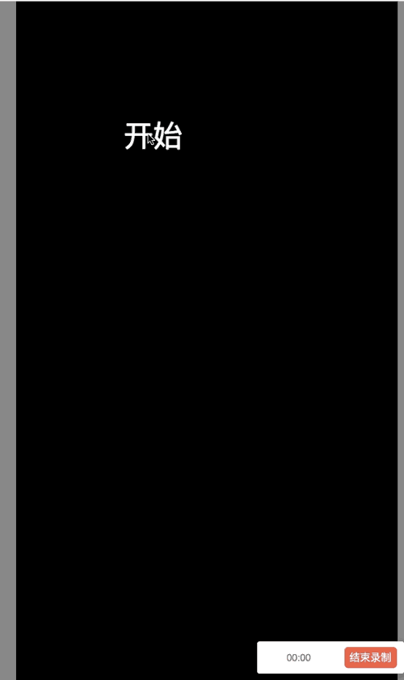
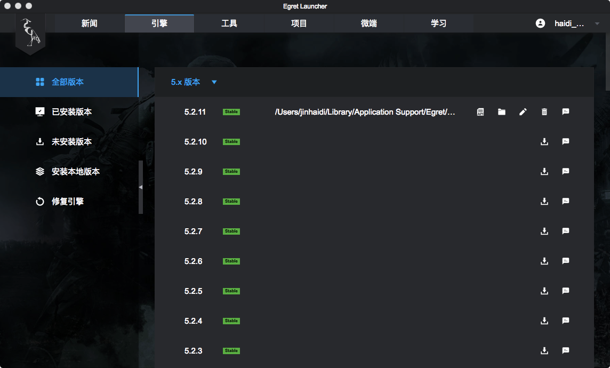
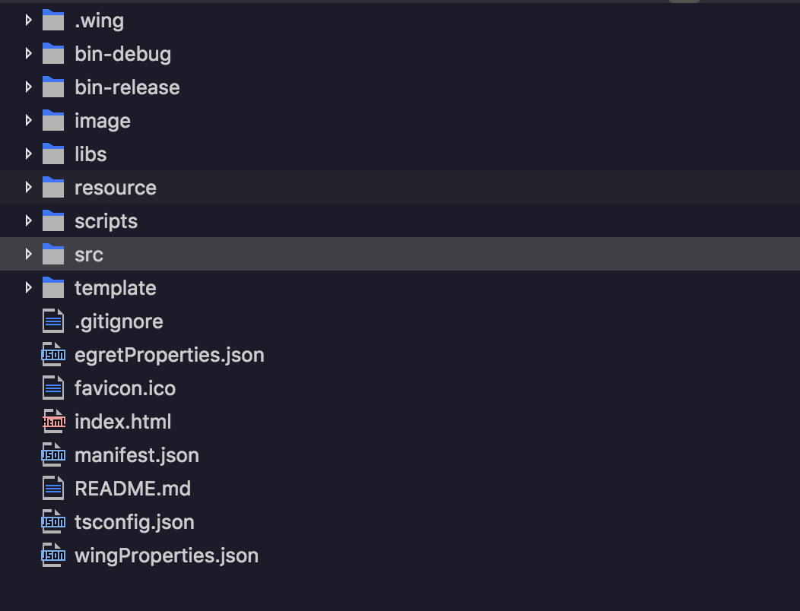
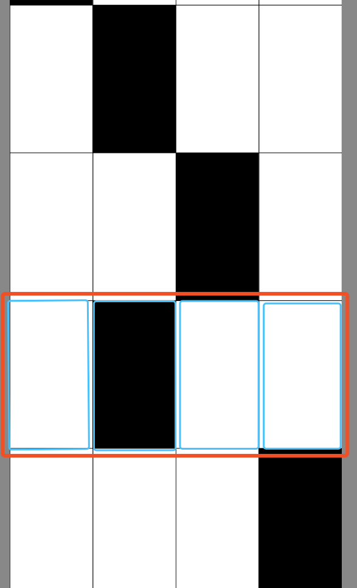

# 别踩白块儿

## 使用（白鹭引擎）Egret编写的游戏


> [游戏地址](http://123.56.220.217/games/)

## 准备工作

- 了解白鹭引擎 并安装编写[工具](http://developer.egret.com/cn/github/egret-docs/Engine2D/projectConfig/installation/index.html)
- 安装游戏引擎



- 安装Egret Wing3


- 创建项目

> 创建项目可以选择不同版本的引擎，创建成功之后还可以查看API，对发布进行设置。
> 目录结构如下

代码主要存放在src文件下（白鹭引擎支持代码为[typescript](https://www.tslang.cn/)）

## 代码编写

> 先说一下整体的思路： 就是将整个游戏细分一下，一个小格子为一个模块，然后每一列为一个大的模块，游戏整体作为一个大的模块，定时器作为一个模块，开始游戏和结束游戏分别作为一个模块。如图：


- 废话少说  开撸开撸

- egret提供server服务`egret startserver -a` -a 表示对文件进行监控自动更新

### BoxGraphics

```typescript
  // 负责初始化小格子
  private init() {
      this.touchEnabled = true;
      this.width = GameData.getBoxWidth();
      this.height = GameData.getBoxHeight();
      this.addEventListener(egret.TouchEvent.TOUCH_BEGIN, this.click, this);
  }
  /**
   * drawBox
   * 绘制内容
   */
  public drawBox(canTouch:boolean=false) {
      this._canTouch = canTouch;
      this.graphics.clear();
      if(canTouch) {
          this.graphics.beginFill(0);
      } else {
          this.graphics.beginFill(0xffffff);
      }
      this.graphics.lineStyle(1, 0);
      this.graphics.drawRect(0,0,GameData.getBoxWidth(),GameData.getBoxHeight());
      this.graphics.endFill();
  }
  /**
   * click
   * 当前方块被点击后的响应事件
   */
  private click(evt:egret.TouchEvent):void {
      this.graphics.clear();
      if(this._canTouch) {
          this.graphics.beginFill(0xcccccc);
      } else {
          this.graphics.beginFill(0xff0000);
      }
      this.graphics.lineStyle(1, 0);
      this.graphics.drawRect(0,0,GameData.getBoxWidth(),GameData.getBoxHeight());
      this.graphics.endFill();

      var event:GameEvent;

      //不能点击，抛出错误事件
      if(!this._canTouch) {
          event = new GameEvent(GameEvent.GAME_OVER);
      } else {
          event = new GameEvent(GameEvent.GAME_HIT);
      }
      this.dispatchEvent(event);
  }

```

### GroupRect

- 一行格子

```typescript
  private init():void {
      this._boxs = [];
      // 生成一行中的每一个格子 并给每个格子添加对应事件
      for(var i:number=0;i<GameData.column;i++) {
          var box:BoxGraphics = new BoxGraphics();
          this._boxs.push(box);
          box.addEventListener(GameEvent.GAME_HIT, this.clickRight, this);
          box.addEventListener(GameEvent.GAME_OVER, this.boxGameOver, this);
          this.addChild(box);
          box.x = GameData.getBoxWidth()*i;
      }
  }
```

### GameView

- 游戏主界面

```typescript
  private init():void {
      this._boxGroups = [];
      var len:number = GameData.row+1;

      // 循环生成每一列格子
      for(var i:number=0;i<len;i++) {
          var boxg:GroupRect = new GroupRect();
          this._boxGroups.push(boxg);
          this.addChild(boxg);
          boxg.addEventListener(GameEvent.GAME_OVER, this.gameOver, this);
          boxg.addEventListener(GameEvent.GAME_HIT, this.clickRight, this);
      }
      /*
      this.scoreText = new egret.TextField();
      this.scoreText.textColor = 0xff0000;
      this.scoreText.bold = true;
      this.scoreText.size = 100;
      */

      // 设置 分数
      this.scoreText = new egret.BitmapText();

      this.scoreText.x = 180;
      this.scoreText.y = 50;
      this.scoreText.text = String(0);
      this.addChild(this.scoreText);
  }
```

- 点击游戏移动函数

```typescript
    public move() {
        var len:number = GameData.row+1;
        for(var i:number=0;i<len;i++) {

            // 游戏加速
            this._boxGroups[i].y += GameData.speed;

            //移动到舞台外侧了
            if(this._boxGroups[i].y>=GameData.getStageHeight()){
                // 如果格子没有被点击 游戏结束
                if(!this._boxGroups[i].isHit) {
                    this.gameOver();
                    return;
                }

                // 设置对应格子的位置
                if(i==0) {
                    this._boxGroups[i].y = this._boxGroups[4].y - GameData.getBoxHeight();
                } else {
                    this._boxGroups[i].y = this._boxGroups[i-1].y - GameData.getBoxHeight();
                }
                this._boxGroups[i].create();
            }
        }
    }
```

### Main

- 入口文件

```typescript
    /**
     * 初始化游戏函数
     * 初始化gameview
     * 初始化定时器
     * 初始化开始|结束 画布
     * 添加事件监听
     */
    private init():void {
        this.gameview = new GameView();
        this.addChild(this.gameview);
        this.gameview.addEventListener(GameEvent.GAME_OVER, this.gameover,this);
        this.timer = new egret.Timer(20,0);
        this.timer.addEventListener(egret.TimerEvent.TIMER, this.timers, this);

        this.gameoverPanel = new GameOverPanel();
        this.gameoverPanel.addEventListener(GameEvent.GAME_START,this.startgame,this);

        this.startgamePanel = new StartGamePanel();
        this.startgamePanel.addEventListener(GameEvent.GAME_START, this.startgame, this);
        this.addChild(this.startgamePanel);
    }

    //定义事件
    /**
     * 游戏结束
     */
    private gameover(evt:GameEvent):void {
        this.timer.stop();
        this.gameoverPanel.update();
        this.addChild(this.gameoverPanel);
    }

    /**
     * 开始游戏
     * 重新设置游戏速度 分数
     * 去除游戏开始|结束画布
     */
    private startgame(evt:GameEvent):void {
        GameData.speed = 10;
        GameData.setScore(0);
        this.gameview.startgame();
        if(this.startgamePanel.parent) {
            this.removeChild(this.startgamePanel);
        }
        if(this.gameoverPanel.parent) {
            this.removeChild(this.gameoverPanel);
        }
        this.timer.start();
    }

```

### 发布

`egret publish`
[官方文档](http://developer.egret.com/cn/github/egret-docs/Engine2D/publish/index.html)

## over

到这里，关于游戏的相关介绍就基本上已经结束了，如果有错误或者不严谨的地方，请务必给予指正，十分感谢。如果喜欢或者有所启发，欢迎 star，对作者也是一种鼓励。
